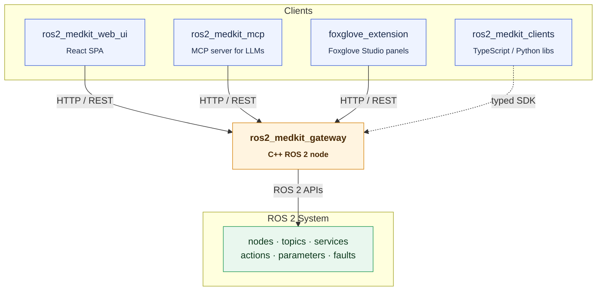

# selfpatch

  <b>Self-healing diagnostics for ROS 2 and Physical AI.</b>

  

  📖 <a href="https://selfpatch.github.io/ros2_medkit/">Docs</a> · 💬 <a href="https://discord.gg/6CXPMApAyq">Discord</a>

selfpatch is the open-source core of a [SOVD](https://www.iso.org/standard/86384.html)-compliant diagnostics stack for robots and software-defined machines. A single REST gateway exposes the full ROS 2 graph - components, health, faults, parameters, operations, updates - in a shape that humans *and* AI agents can actually reason about.

> **SOVD** = ISO 17978, the modern successor to UDS: HTTP/JSON, schema-first, AI-friendly. selfpatch makes it native to ROS 2.

---

## Why selfpatch

Diagnostics on modern robots and SDVs are fragmented, per-vendor, human-clickthrough - and mostly invisible to the AI agents operating the system. selfpatch changes that:

- **One REST API** for the whole ROS 2 graph - no ad-hoc scripts per rig
- **A machine-readable model** - AI agents can discover, explain, and act with justification
- **Bridges over rewrites** - integrates with what your robots run today (ROS 2, SOVD, UDS, OPC UA, …)

---

## Projects

| Repository | What it is |
|------------|------------|
| [ros2_medkit](https://github.com/selfpatch/ros2_medkit) | C++17 SOVD gateway - the core REST server that fronts the ROS 2 graph |
| [ros2_medkit_web_ui](https://github.com/selfpatch/ros2_medkit_web_ui) | React 19 entity browser with inline parameter and operation control |
| [ros2_medkit_mcp](https://github.com/selfpatch/ros2_medkit_mcp) | Model Context Protocol server - 47 tools that let Claude, GPT & co. diagnose robots |
| [ros2_medkit_foxglove_extension](https://github.com/selfpatch/ros2_medkit_foxglove_extension) | Foxglove Studio panels - entity browser and live fault dashboard |
| [ros2_medkit_clients](https://github.com/selfpatch/ros2_medkit_clients) | Typed TypeScript and Python clients generated from the OpenAPI spec |
| [selfpatch_demos](https://github.com/selfpatch/selfpatch_demos) | `docker compose up` demos with TurtleBot3 + Nav2 and a sensor-diagnostics rig |

---

## Architecture

---

## Who it's for

- **Robotics teams on ROS 2** that need better remote diagnostics and observability
- **SDV and mobility engineers** modernizing diagnostics without rewriting the stack
- **AI/ML teams** building autonomous diagnostics and remediation with LLMs
- **Platform teams** wiring up monitoring, OTA, and AI-driven operations

If you've ever thought *"we can't safely automate fixes because we don't really understand what's running where"* - you're in the right place.

---

## Get involved

- **Try the 5-minute demo** → [`selfpatch_demos`](https://github.com/selfpatch/selfpatch_demos)
- **Share a pain point** from your fleet in an [issue](https://github.com/selfpatch/ros2_medkit/issues) or on [Discord](https://discord.gg/6CXPMApAyq)
- **Write a plugin** - the gateway and MCP server both expose plugin interfaces
- **Star the repos you care about** - it helps us prioritize

Apache 2.0. See individual repository `CONTRIBUTING.md` files for guidelines.
