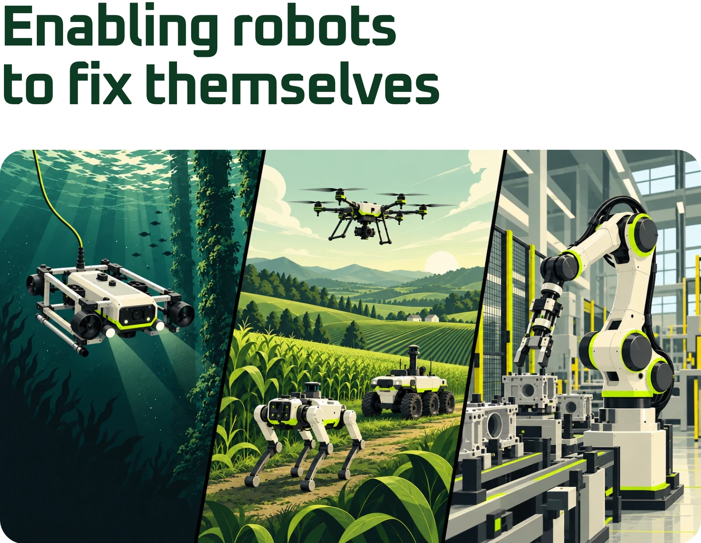
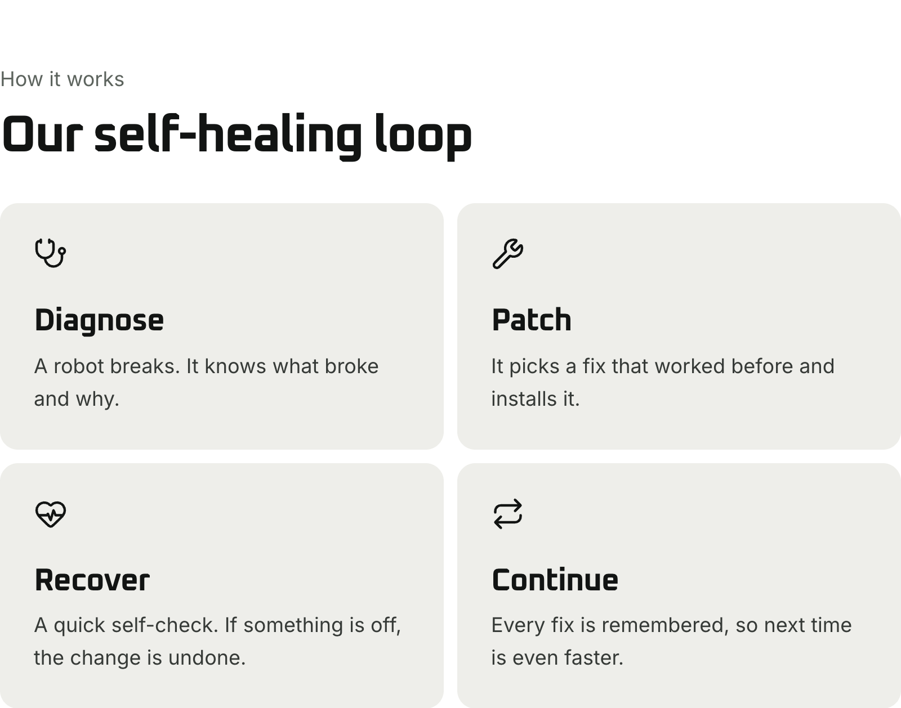
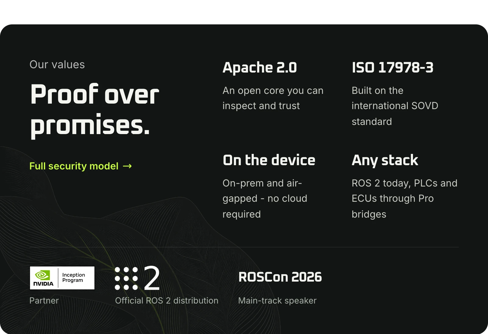
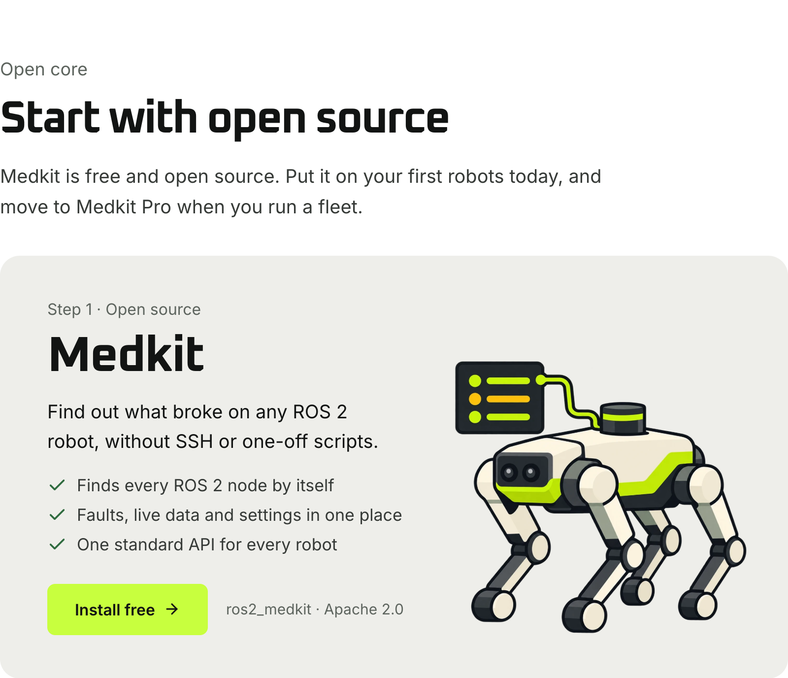
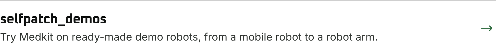
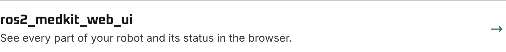
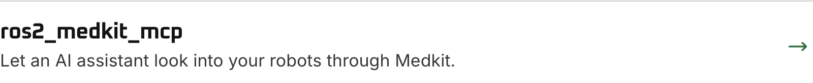
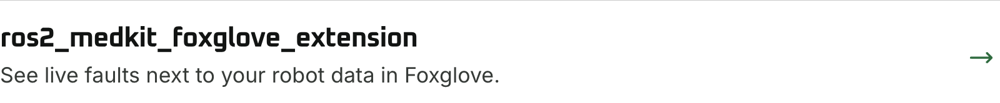
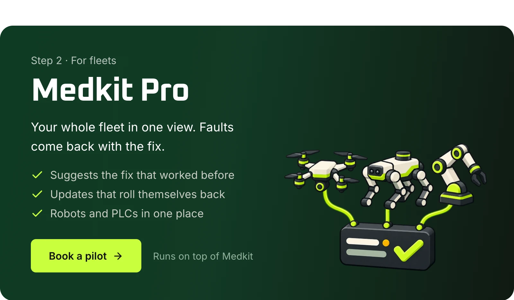

<!-- Images are drawn from profile/design/assets.html in the selfpatch.ai brand. Run `node profile/design/render.mjs` after changing them. -->

<a href="https://selfpatch.ai"><picture><source media="(prefers-color-scheme: dark)" srcset="assets/hero-dark.webp"></picture></a>

&nbsp;
<a href="https://selfpatch.github.io/ros2_medkit/"><picture><source media="(prefers-color-scheme: dark)" srcset="assets/btn-docs-dark.png"></picture></a>&nbsp;
<a href="https://discord.gg/6CXPMApAyq"><picture><source media="(prefers-color-scheme: dark)" srcset="assets/btn-discord-dark.png"></picture></a>&nbsp;
<a href="https://selfpatch.ai"><picture><source media="(prefers-color-scheme: dark)" srcset="assets/btn-website-dark.png"></picture></a>

<picture><source media="(prefers-color-scheme: dark)" srcset="assets/loop-dark.png"></picture>

<a href="https://github.com/selfpatch/ros2_medkit"><picture><source media="(prefers-color-scheme: dark)" srcset="assets/start-dark.png"></picture></a>

<picture><source media="(prefers-color-scheme: dark)" srcset="assets/works-with-dark.png"></picture>

<a href="https://github.com/selfpatch/selfpatch_demos"><picture><source media="(prefers-color-scheme: dark)" srcset="assets/repo-selfpatch_demos-dark.png"></picture></a>
<a href="https://github.com/selfpatch/ros2_medkit_web_ui"><picture><source media="(prefers-color-scheme: dark)" srcset="assets/repo-ros2_medkit_web_ui-dark.png"></picture></a>
<a href="https://github.com/selfpatch/ros2_medkit_mcp"><picture><source media="(prefers-color-scheme: dark)" srcset="assets/repo-ros2_medkit_mcp-dark.png"></picture></a>
<a href="https://github.com/selfpatch/ros2_medkit_foxglove_extension"><picture><source media="(prefers-color-scheme: dark)" srcset="assets/repo-ros2_medkit_foxglove_extension-dark.png"></picture></a>
<a href="https://github.com/selfpatch/ros2_medkit_clients"><picture><source media="(prefers-color-scheme: dark)" srcset="assets/repo-ros2_medkit_clients-dark.png"></picture></a>

Machines that heal themselves. Built to keep the world working. <a href="https://selfpatch.ai">selfpatch.ai</a> · <a href="https://selfpatch.github.io/ros2_medkit/">Docs</a> · <a href="https://discord.gg/6CXPMApAyq">Discord</a> · <a href="https://www.linkedin.com/company/self-patch">LinkedIn</a> · <a href="https://www.youtube.com/@SelfPatch-ai">YouTube</a>
